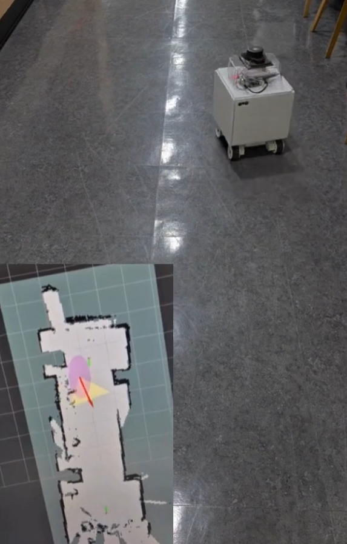
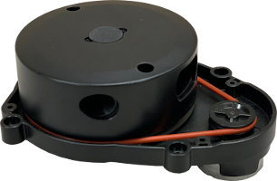
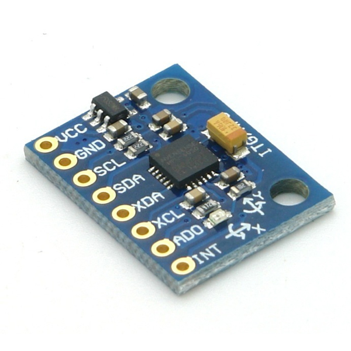
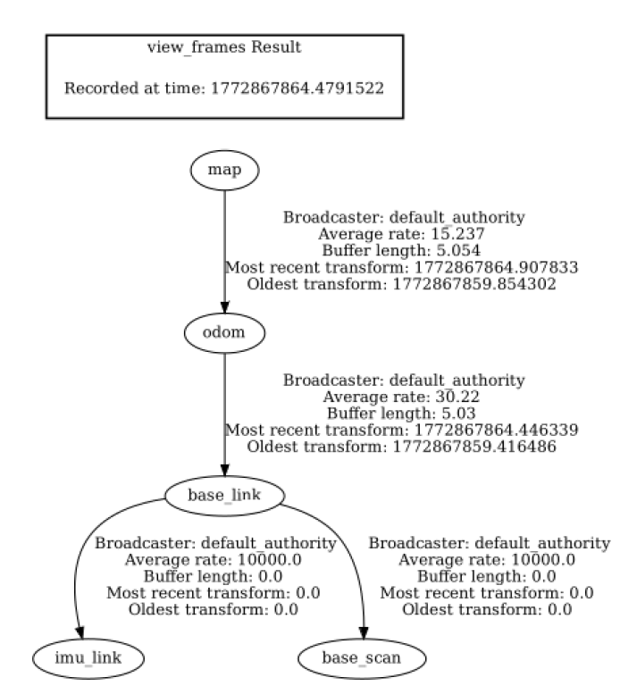
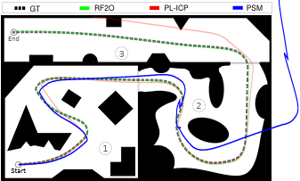
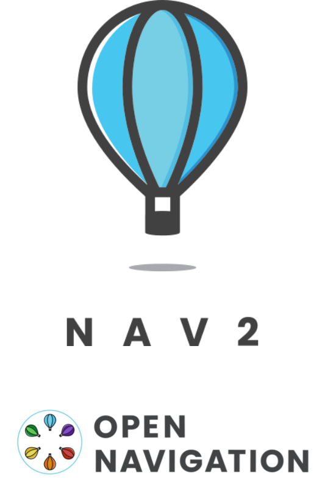

# 🚀 ROS 2 Cartographer SLAM & Nav2 Project for RPi 5



*▲ 실제 구동 중인 자율주행 로봇(우측 상단)과 생성된 지도 위에서 로봇의 위치 및 레이저 스캔을 시각화한 모습(좌측 하단)*

이 프로젝트는 Raspberry Pi 5 환경에서 ROS 2 (Jazzy)를 기반으로 LD08 라이다와 MPU6050 IMU 센서를 융합하여 2D Cartographer SLAM을 수행하고, 생성된 지도를 바탕으로 Navigation2(Nav2) 자율주행을 구현한 종합 패키지입니다.

## 🛠 System Overview & Requirements

* **OS/Middleware**: Ubuntu & ROS 2 Jazzy
* **Sensors**: 
    * **LiDAR**: LD08 (`ld08_driver` 패키지 사용)
        <br>

        *LD08 라이다는 2D 평면 스캔을 담당하며 Cartographer 맵 생성과 장애물 회피의 핵심 입력 데이터로 사용됩니다.*
    * **IMU**: MPU6050 (I2C 통신, `ros2_mpu6050` 노드 사용)
        <br>

        *MPU6050은 로봇의 회전 및 가속도 정보를 제공하여 주행 중 발생하는 오도메트리 오차를 보정합니다.*
* **Key Algorithms**: Cartographer (2D SLAM), RF2O Laser Odometry, Robot Localization (EKF), Navigation2

---

## 📂 Key Features & Node Configuration

### 1. Cartographer 2D SLAM (`my_carto.lua`)


Raspberry Pi 5의 하드웨어 리소스 한계를 고려하여 최적화된 파라미터가 적용되었습니다.
* **IMU 융합**: `TRAJECTORY_BUILDER_2D.use_imu_data = true`로 설정하여 IMU 데이터를 궤적 생성에 적극 반영합니다.
* **프레임 설정**: `tracking_frame`은 `base_link`를 사용하며, EKF 노드가 Odom을 자체적으로 발행하므로 충돌 방지를 위해 `provide_odom_frame`은 `false`로 설정했습니다.
* **연산량 최적화**: 라이다 스캔의 최대 거리(`max_range`)를 8.0m로 제한하고, 루프 클로징 최적화 주기(`optimize_every_n_nodes`)를 45로 설정하여 RPi5의 CPU 부하를 대폭 감소시키고 시스템 안정성을 확보했습니다.


*▲ RViz를 통해 실시간으로 SLAM 기반 지도가 생성되는 모습. 제한된 센서 환경에서도 격자 지도(Grid Map) 위에 로봇의 궤적과 스캔 데이터가 안정적으로 매칭되고 있습니다.*

### 2. Sensor Fusion & Odometry (`my_ekf.yaml`)


*▲ 현재 시스템의 TF 트리 구조: `map` -> `odom` -> `base_link`를 거쳐 각 하위 센서 링크(`imu_link`, `base_scan`)로 이어지는 안정적인 좌표계 변환 흐름을 보여줍니다.*

* **RF2O Laser Odometry**: 라이다 스캔 데이터를 바탕으로 실시간 2D 오도메트리를 추정합니다.
    * **성능 검증**: 아래 평가지표와 성능 자료에서 볼 수 있듯, RF2O는 다른 알고리즘(PSM, PL-ICP) 대비 연산 속도(Runtime)가 매우 빠르고 RMSE 오차율이 낮아 라즈베리파이처럼 리소스가 제한된 환경에 최적화되어 있습니다.
    <br>
    <br>

    *▲ Ground Truth(GT) 대비 각 오도메트리 알고리즘의 궤적 비교. RF2O(초록색)가 GT와 가장 근접하게 주행함을 알 수 있습니다.*

* **EKF Filter (`robot_localization`)**: `two_d_mode: true` 및 `publish_tf: true` 로 설정되어 2D 평면 상의 최종 `odom` 좌표계를 시스템에 발행합니다.

### 3. Navigation2 (`nav2_slam_params.yaml`)


안정적인 자율주행을 위한 Nav2 파라미터 세부 설정입니다.
* **Controller Server**: 로봇이 주행 중 경로를 이탈하거나 제어가 지연될 때 발생하는 Aborted 오류를 방지하기 위해 `failure_tolerance`를 10000.0초로 넉넉하게 설정했습니다.
* **Costmap 튜닝**: 로봇의 크기(`robot_radius`)는 0.22m로 반영되었으며, 장애물 인식의 최대 범위(`obstacle_max_range`)는 2.5m, 레이트레이싱(`raytrace_max_range`)은 3.0m로 튜닝되었습니다.
* **Planner Server**: A* 알고리즘 대신 `NavfnPlanner`를 기본 플래너로 사용합니다 (`use_astar: false`).

### 4. Custom UDP 제어 통신 (`nav2_to_udp_mapper.py`)
* 자율주행 시 Nav2의 `cmd_vel` (`geometry_msgs.msg.Twist`) 형태 제어 명령을 수신하여, 외부 시스템으로 전달할 수 있도록 UDP 소켓 통신을 지원하는 커스텀 매퍼 노드가 구현되어 있습니다.

---

## 🚀 Execution Flow (Launch Scripts)

단일 스크립트 실행만으로 꼬여있는 프로세스를 정리하고 센서와 주요 알고리즘을 한 번에 실행할 수 있도록 Bash 스크립트가 지원됩니다.

**실행 흐름 로직:**
1.  **초기화**: 기존에 실행 중이던 ROS 2 데몬, 라이다(`ld08`), IMU(`mpu6050`), Nav2 관련 프로세스들을 `pkill -9`로 깔끔하게 강제 종료합니다.
2.  **센서 구동**: `i2cset` 명령어로 MPU6050를 초기화한 뒤 센서 노드들을 백그라운드(`&`)로 실행합니다.
3.  **오도메트리 & TF**: RF2O 레이저 오도메트리와 가상 TF(`slam_back.launch.py`)를 순차적으로 실행합니다.
4.  **프로세스 종료 관리**: 스크립트 종료 시 `trap "kill 0" EXIT` 명령이 작동하여 띄워둔 모든 백그라운드 프로세스를 함께 안전하게 종료합니다.

### 사용 방법 (Usage)

**1. SLAM (지도 작성) 모드 실행**
```bash
# carto_slam.launch.py를 실행하여 맵 생성
./run_slam.sh

**2. Nav (자율 주행) 모드 실행**
```bash
# carto_slam.launch.py를 실행하여 맵 생성
./run_nav.sh